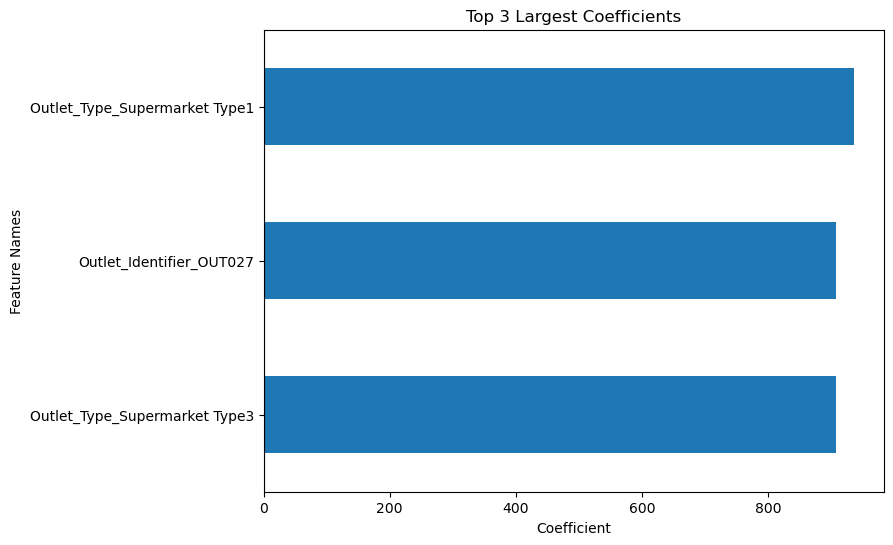
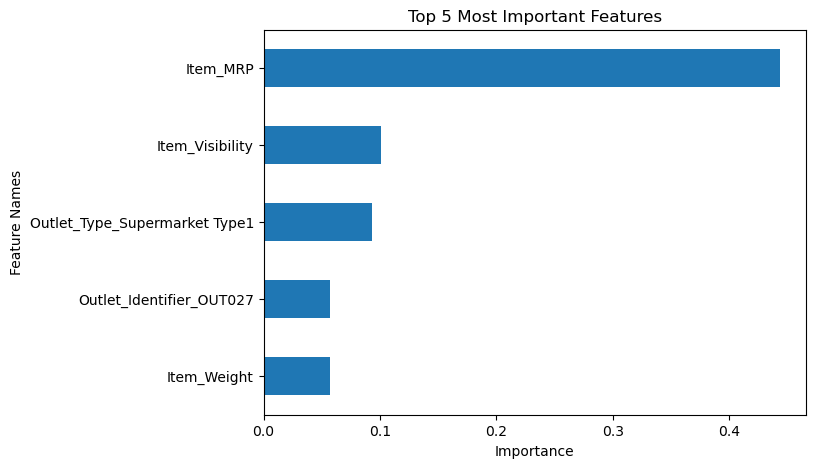

According to the LinearRegression model, it Looks like the top 3 features would be: 
- Supermarket Type1
- Supermarket Type 3
- and Outlet 027

This shows that the location of the outlet the items are in and the type of market heavily influences whether or not the item will sell.

According to the RandomForestRegression model, it Looks like the top  features would be:
- Item MRP
- Item Visibility
- Supermarket Type1
- Outlet 027
- Item Weight

This shows that the price, visibility, item weight, supermarket type and outlet heavily influences whether or not the item will sell.

The RandomForest Model agrees with the LinearRegression model that Type1 Supermarket and Outlet 027 seem to be a big influence.