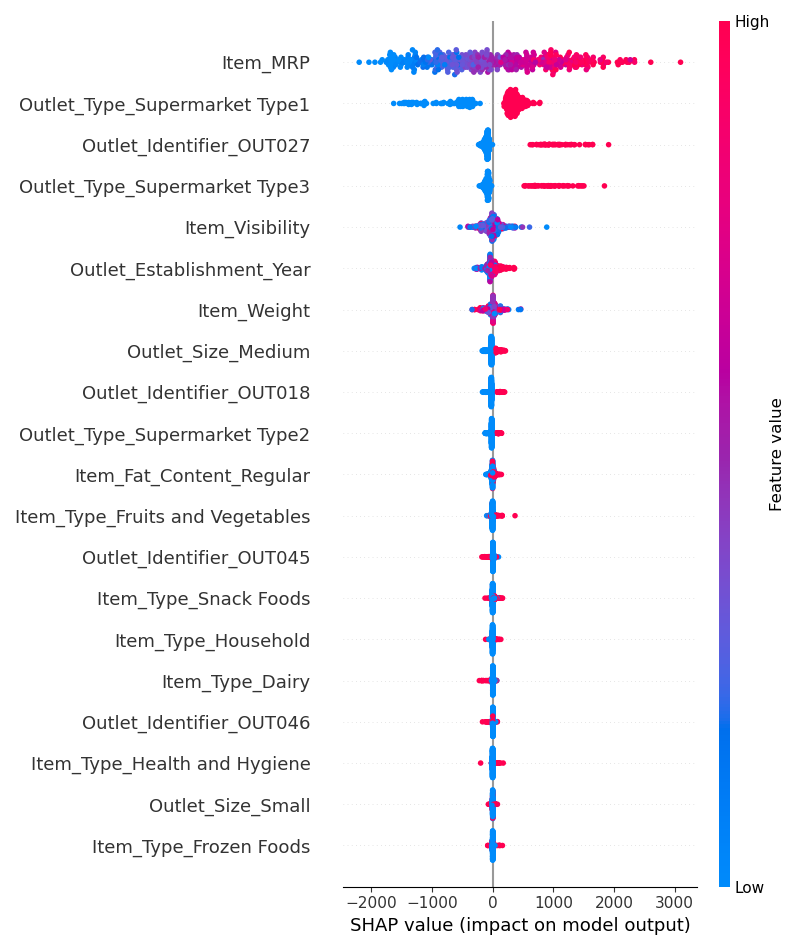
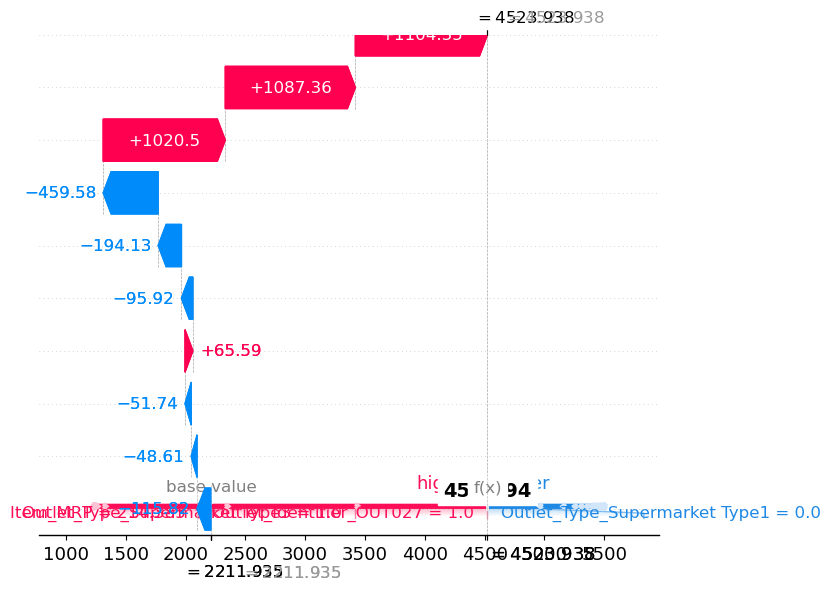
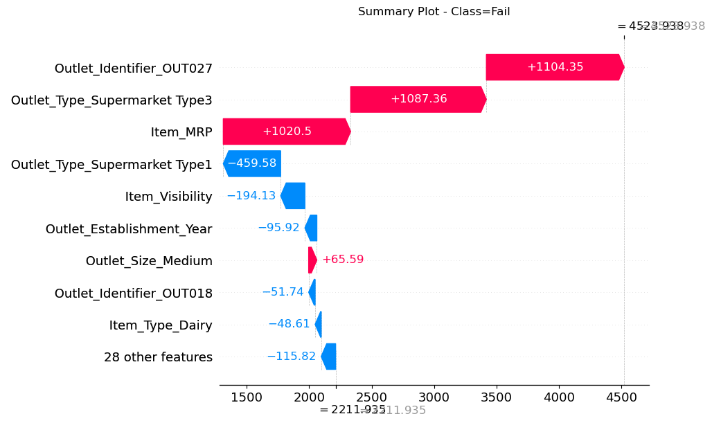

According to the LinearRegression model, it Looks like the top 3 features would be: 
- Supermarket Type1
- Supermarket Type 3
- and Outlet 027

This shows that the location of the outlet the items are in and the type of market heavily influences whether or not the item will sell.

According to the RandomForestRegression model, it Looks like the top  features would be:
- Item MRP
- Item Visibility
- Supermarket Type1
- Outlet 027
- Item Weight

This shows that the price, visibility, item weight, supermarket type and outlet heavily influences whether or not the item will sell.

The RandomForest Model agrees with the LinearRegression model that Type1 Supermarket and Outlet 027 seem to be a big influence.

When comparing the Feature Importance versus the Shap Summary plots, 4 of the top 5 Features are the same in both but are ranked differently. Item_MRP is the most important in both.

According to the dot summary plot, the top 3 most import features are:
- Item MRP
- Supermarket Type 1
- Outlet 27

A higher MRP lead to more sales and items sold more in Type 1 and Outlet 27

In this example, being in outlet 27, being in a Type 3 outlet and having a high MRP were the greatest influences for having high sales for this item.

According to LIME, the top positive features that helped increase the sales are the MRP, that it is in Outlet 27, and it is a Type 3 Supermarket.
The biggest factor for having a lower sales is that it is not a Type 1 supermarket.

In the Low-selling Outlet Example,the item MRP helped influence the sales but not enough to compensate for it  not being in outlet 27, and not being in either a type 1 or type 3 supermarket

The biggest factors contributing to this example having low sales were it not being a Type 1 or Type 3 supermarket and not being in Outlet 27. The MRP helped in a positive way but not enough to compensate for the other factors.

