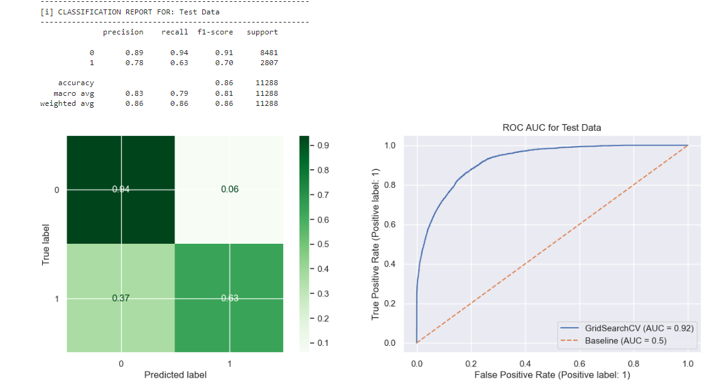
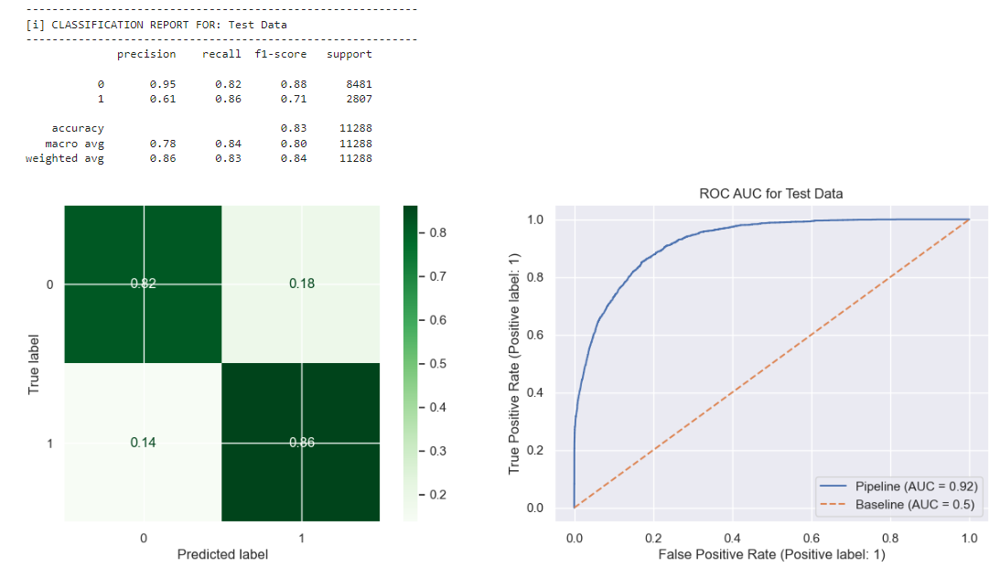
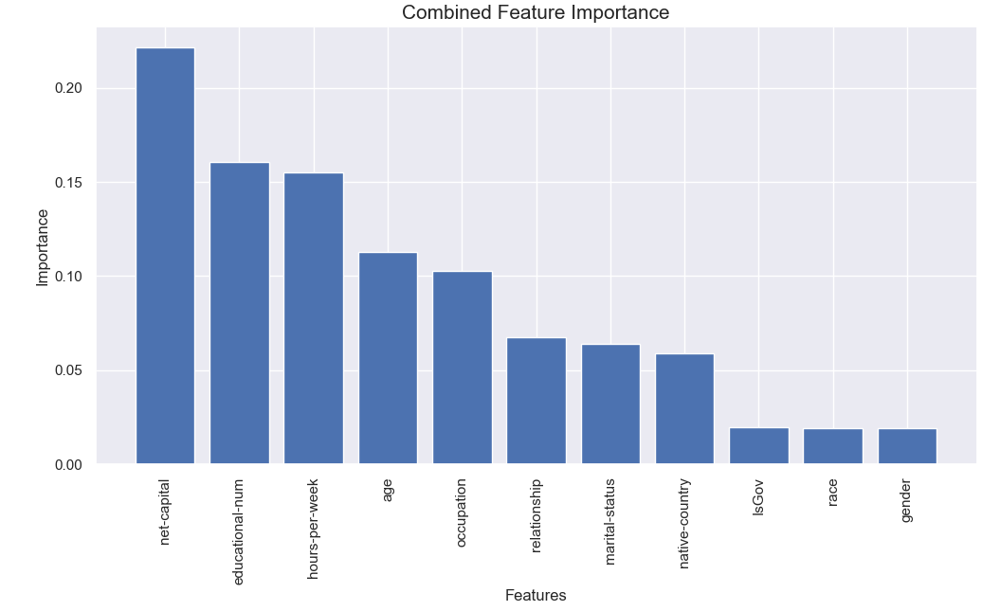
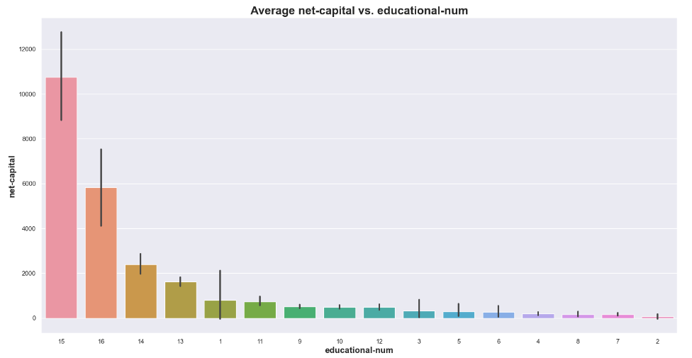
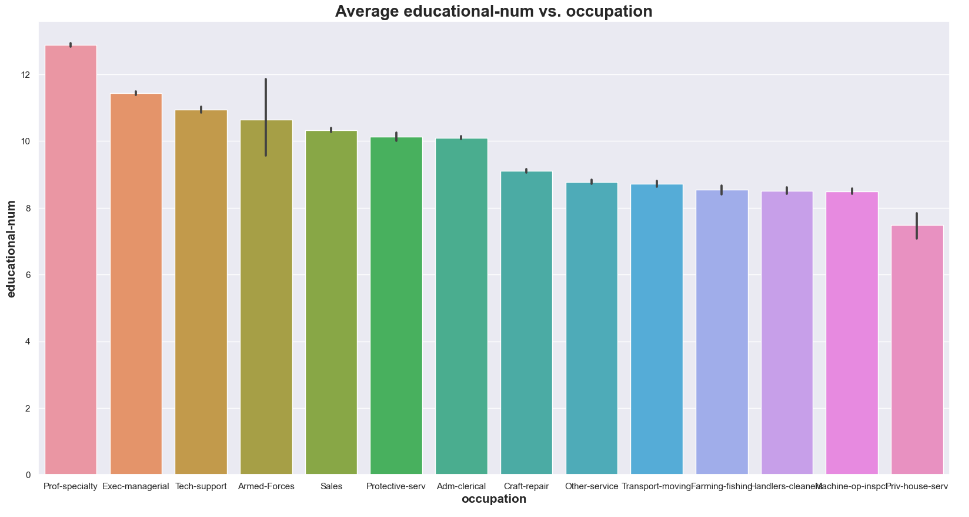
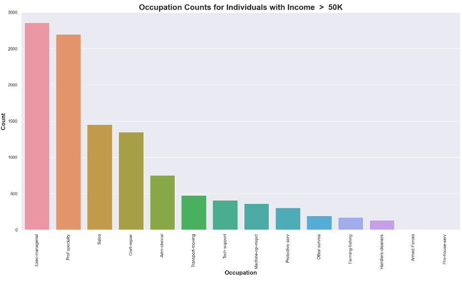

## Business Problem:
To determine whether an indivual's income is likely to be above or below $50,000 based on their demographic and other features.

## Stakeholders: 
general public, local goverment, and non-profits who can assist the community 

## Source: 
Data was extracted by Barry Becker from the 1994 Census database
https://www.kaggle.com/datasets/wenruliu/adult-income-dataset

## Description:
There are 14 features such as age, education, marital status and 48842 entries.
The dataset includes a target divided into two classes: <=50K and >50K which signifies annual income.

## Analytical Insights
Best Models were Grid Search for LGBM and a Weighted LGBM

Most Important Features:
I would Net Capital is more of an effect more than a cause since the more money you make, the more likely you will have money saved up.

Are far as those with the highest education seemed to have the most capital.

The top occupations with the highest average education level were Professional Specialty and Executive Management.

The occupations with the most counts of income over $50k were Executive Management and Professional Specialty

